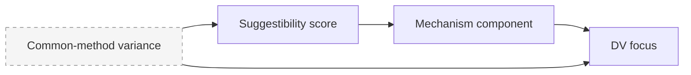

# mpi-hypothesis

Generate structured research hypotheses from the global synchronic analysis. Requires
`global_synchronic: done` in manifest.

## Prerequisites

- `.mpi/project.json` must exist
- All `global_synchronic.*`, `generic_diachronic.*`, and `generic_synchronic.*` substeps `done` in manifest
- `bookowhy_rev.md` must be readable (check: first look at `bookowhy_rev.md` relative
  to the current working directory, then at the repo root)

## Context documents

Resolve all upstream analysis artifacts using the `inputs` verb:
```bash
python scripts/mpi_step.py inputs --stage hypothesis --scope <dv-focus-scope> --run-dir .
```
This returns all three cross-participant artifact sets as a JSON list:
`{resolved: [{path, sha256}, ...]}` — includes `generic_diachronic.cross_iv_contrast`,
`generic_synchronic.isu_second_level_grouping`, and `global_synchronic.global_synchronic` artifacts.

Read and pass to the cross-analyst:
1. All resolved artifact paths from the `inputs` verb — the complete evidence base
2. `bookowhy_rev.md` — causal framing context (Pearl's causal hierarchy: association,
   intervention, counterfactual)

## Invoking mpi-cross-analyst

Invoke `mpi-cross-analyst` with:
- Task type: `hypothesis_generation`
- All resolved analysis artifacts (paths from `inputs` verb output)
- Content of `bookowhy_rev.md` labelled as "Causal framing context:"
- Instruction:
  ```
  Generate causal research hypotheses from the global synchronic patterns above.
  For each cross-participant pattern, produce a structured hypothesis entry.
  If no meaningful cross-participant patterns are present, produce an explicit
  "no hypothesis" output (do not produce an empty file).
  ```

The cross-analyst's hypothesis generation instructions (add to mpi-cross-analyst.md
in a `### Hypothesis generation` section):

```markdown
### Hypothesis generation

Read the global synchronic patterns and the causal framing context. For each pattern
that appears across multiple participants in the same score category:

1. Identify the independent variable (IV) — what varies (e.g., hypnotic suggestibility score)
2. Identify the dependent variable (DV) — what the pattern describes (e.g., felt sense of automaticity)
3. Describe the pattern — the qualitative relationship observed
4. Assign Pearl ladder rung:
   - Rung 1 (Association): "Participants who score high are more likely to report X"
   - Rung 2 (Intervention): "If we intervene to change X, Y would change"
   - Rung 3 (Counterfactual): "Had the participant not received the suggestion, they would not have experienced X"
5. Assign confidence 1–5
6. List source IDUs/ISUs (participant + IDU/ISU name)
7. Suggest a quantitative follow-up test

If no cross-participant patterns exist, write:
```markdown
## No Hypotheses Generated

No consistent cross-participant patterns were identified in the global synchronic analysis.
This may indicate: (a) high individual variation, (b) insufficient participants for pattern
detection, or (c) the patterns are idiosyncratic to individual experiences.

Suggested next step: Review the global synchronic analysis for qualitative themes that
did not meet the cross-participant threshold.
```
```

## Output format

Write `analyses/hypotheses.md`:

```markdown
# MPI Research Hypotheses

Generated from global synchronic analysis of N participants.

## Hypothesis 1: <Short title>

| Field | Value |
|---|---|
| Independent Variable | Hypnotic suggestibility score (0–5) |
| Dependent Variable | <DV description> |
| Pattern | <Description of the qualitative relationship> |
| Pearl Ladder Rung | <1 (Association) / 2 (Intervention) / 3 (Counterfactual)> |
| Confidence | <1–5>/5 |
| Suggested Test | <quantitative follow-up> |

**Source IDUs/ISUs:**
- p1s1: <IDU/ISU name>
- p4s3: <IDU/ISU name>
...

**Replication recommendation** (`replication_recommendation`): A second participant set would need to show [X] to corroborate this mechanism.

**Causal DAG:**


---
[Repeat for each hypothesis]
```

If no patterns: write the "no hypotheses" output above.

## Anti-fabrication rule

If your input artifacts (transcripts, upstream substep outputs) are missing, empty, or
malformed, return `ERROR <reason>` and stop. Never generate placeholder or synthetic
content to make the pipeline appear to progress.

## Closure (mandatory)

Each hypothesis substep closes its own four-part transaction via `mpi_step.py close`.
All three are LLM substeps; `mpi-cross-analyst` owns persistence for all.

| Substep | Actor | Artifacts | Scope | Notes |
|---------|-------|-----------|-------|-------|
| `hypothesis.evidence_extraction` | mpi-cross-analyst (LLM) | `hypotheses/dv-<focus>.evidence.{json,md,prompt.json}` | `dv-<focus>` | One per DV focus; gathers pattern variations from all upstream sources |
| `hypothesis.candidate_drafting` | mpi-cross-analyst (LLM) | `hypotheses/dv-<focus>.candidates.{json,md,prompt.json}` | `dv-<focus>` | Drafts candidate mechanism hypotheses with claim-level evidence + `raw_span_refs`; mandatory `disclaimer` field |
| `hypothesis.weak_evidence_review` | mpi-cross-analyst (LLM) | `hypotheses/review_summary.{json,md,prompt.json}` | `global` | Flags thin-support hypotheses and unsupported causal language |

**Prerequisite gate:** `hypothesis.evidence_extraction` is blocked until `generic_diachronic.*`, `generic_synchronic.*`, AND `global_synchronic.*` are all `done`.

**Disclaimer mandate:** Every `hypothesis.candidate_drafting` artifact MUST carry this verbatim field:
```
"disclaimer": "These are generative conjectures inferred from qualitative pattern variation across IV levels in a small sample. They are not causal estimates from a hypothesis test and should not be reported as such."
```
The schema validator enforces this field's presence.

**DV focus provenance field:** Every `hypothesis.candidate_drafting` artifact MUST also
carry a `dv_focuses_provenance` field whose value is:
- `"researcher_specified"` — when `study.dv_focuses` was declared at `confirm_study_config`
- `"emergent"` — when `study.dv_focuses` is null (focuses named by the LLM from analysis)

Read the provenance from `manifest["study"].get("dv_focuses_provenance")`.
`confirm_study_config` writes this sibling field automatically:
non-null `study.dv_focuses` → `"researcher_specified"`; null → `"emergent"`.

This field is for auditability: it makes explicit whether the hypothesis was constrained
to pre-declared DVs or emerged from the analysis.

**Commit message format:** `mpi: mpi-cross-analyst hypothesis.<substep> <scope> (<N>units <K>flagged)`
